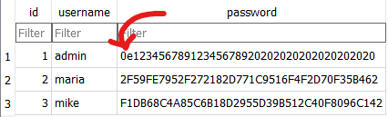
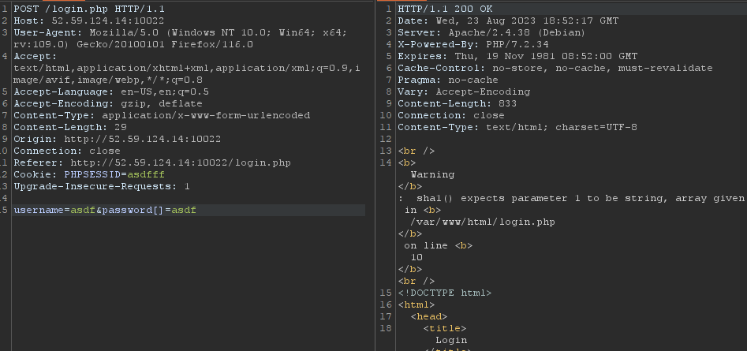

# 
 NULLCON CTF Web Writeups 

Hello everyone!   Today I'm writing my writeup for the CTF Challenges on Nullcon that I've done.
Those challenges are all Web related and these are the challenges I've done: <code>TYpicalBoss</code>, <code>Debugger</code>, <code>IPfilter</code>, <code>Colorful</code>, <code>Magic Cars</code>.
 
Let's see now:
 
# > TYpicalBoss
This was probably the easiest one of all, since I already did some CTFs where <a href="https://secops.group/php-type-juggling-simplified/" target="_blank">PHP Type Juggling</a> was the key to it.  
This was the Description of TYpicalBoss Challenge:  
<code>
My boss just implemented his first PHP website. He mentioned that he managed to calculate a hash that is equal to 0??? I suppose he is not very experienced in PHP yet.
</code> after I read that I looked up at / and there were some files there and one important there was the .db file, I downloaded that file and opened it.  
I saw the Hash of the password from admin and already knew what it was about, since I already did <a href="https://secops.group/php-type-juggling-simplified/" target="_blank">PHP Type Juggling</a> challenges.  
  
The description and that Hash already made me think it's gonna be PHP Types, I first tried to find out which hashing algorithm it uses so I could search for a Magic Number/String that could match the Type for that algorithm. 
I tried figuring out the hashing algorithm by adding [] to the username/password parameter so I could get an PHP Error/Warning, that it is not an array, I may get some Info like that. 
 
I actually succeded, it's sha1!  After some Google Search I found this <code>10932435112</code> "Magic" Number that should work with sha1 algorithm and guess what, it actually worked.

 
I got the flag 😁: <code>ENO{m4ny_th1ng5_c4n_g0_wr0ng_1f_y0u_d0nt_ch3ck_typ35}</code>
 
# > Debugger

